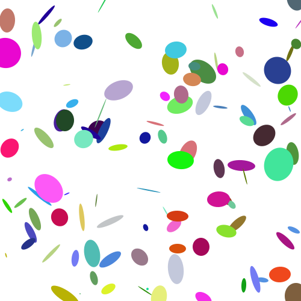

<h1 align="center">offcircle</h1>

<div align="center">
  
</div>
<div align="center">
  <strong>JavaScript Generative Art</strong>
</div>
<div align="center">
  <i>A recreation of the Matplotlib Ellipse Demo in JavaScript</i>
</div>
<br />
<div align="center">
  <a href="https://www.npmjs.com/package/offcircle">
    
  </a>
</div>


## Installation

```bash
npm install offcircle
```

## API

The offCircle function operates on the Canvas API (node & browser).

1. `ctx` =  2D canvas context to render on
2. `ellipseCount` = Number of ellipses to render on the canvas (defaults to 120)

returns `Void`

```javascript
offCircle(ctx,ellipseCount)
```

## Usage

### Node
```javascript
import fs from 'fs'
import path from 'path'
import Canvas from 'canvas'
import offCircle from 'offcircle'

// or common js

var fs = require('fs')
var path = require('path')
var Canvas = require('canvas')
var offCircle = require('offcircle')

var canvas = Canvas.createCanvas(500, 500)
var ctx = canvas.getContext('2d')
offCircle(ctx, 120)

var out = fs.createWriteStream(path.join(__dirname, '/example.png'))
var stream = canvas.createPNGStream()
stream.on('data', function (chunk) {
  out.write(chunk)
})
```

### Web (React)

```javascript
import React, { useEffect } from 'react';
import './App.css';
import offCircle from "offcircle";

function App() {
  const canvasRef = React.useRef(null);
  useEffect(()=> {
    const canvas = canvasRef.current
    const ctx = canvas.getContext('2d')
    offCircle(ctx,1000)
  })
  return (
    <div className="App">
    <canvas
      ref={canvasRef}
      width={window.innerWidth}
      height={window.innerHeight}
    />
    </div>
  );
}

export default App;

```
## License
MIT

## Original Matplotlib Python Demo
[Ellipse Demo](https://matplotlib.org/3.1.1/gallery/shapes_and_collections/ellipse_demo.html#sphx-glr-gallery-shapes-and-collections-ellipse-demo-py)
